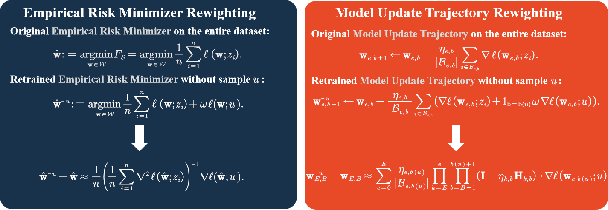

This temporary repository is the supplementary code of the paper "**Efficient and Generalizable Second-Order Unlearning: A Hessian-Free Online Model Updates Approach**".

**Existing Second-Order Certified Unlearning Schemes:**  
- *In the left figure* (**NS**, **IJ** Methods), the weighting factor $\omega=0$ represents the original Empirical Risk Minimizer , while $\omega=-\frac{1}{n}$ indicates the retrained Empirical Risk Minimizer .  
- *In the right figure* (**HF** Method), the weighting factor $\omega=0$ represents the original Model Update, and $\omega=-1$ represents the retrained Model Update.

# Quick Start Guide
### 1. Model Learning and Unlearning
We first obtain the learned model and the unlearned models, which can be done using the following commands:

**Proposed Hessian-Free method**:

        python3 -u main_proposed.py --model logistic --dataset mnist --epochs 15  --num_dataset 1000 --batch_size 32 --num_forget 50 --lr 0.05  --regularization 0.5 --lr_decay 0.995 --clip 5 --gpu 0  --seed 124
        
**Retraining method**:

        python3 -u main_retrain.py --model logistic --dataset mnist --epochs 15  --num_dataset 1000 --batch_size 32 --num_forget 50 --lr 0.05  --regularization 0.5 --lr_decay 0.995 --clip 5 --gpu 0  --seed 124

We commented out the evaluation of NS and IJ in utils/Evaluate_Euclidean.py, so you can skip NS and IJ and directly evaluate our proposed method (as calculating the Hessian takes a considerable amount of time). If you want to evaluate NS and IJ, please uncomment the code and execute the following commands:

**Newton Step method (Unofficial implementation)**:

        python3 -u main_NU.py --model logistic --dataset mnist --epochs 15  --num_dataset 1000 --batch_size 32 --num_forget 50 --lr 0.05  --regularization 0.5 --lr_decay 0.995 --clip 5 --gpu 0  --seed 124

**Infinitesimal Jackknife method (Unofficial implementation)**:

        python3 -u main_IJ.py --model logistic --dataset mnist --epochs 15  --num_dataset 1000 --batch_size 32 --num_forget 50 --lr 0.05  --regularization 0.5 --lr_decay 0.995 --clip 5 --gpu 0  --seed 124

All results are included in ./log.

### 2. Evaluate Distance
We then evaluate the $L_2$ norm between unleaned model and retrained model:

        python3 -u main_eva.py --model logistic --dataset mnist --epochs 15  --num_dataset 1000 --batch_size 32 --num_forget 50 --lr 0.05 --regularization 0.5 --lr_decay 0.995 --clip 5 --gpu 0  --seed 124

All results are included in ./results.

### 3. Membership Inference Attack
Finally, we conduct the MIA (Membership Inference Attack) evaluation:

        python3 -u main_MIAU.py --model logistic --dataset mnist --epochs 15 --num_dataset 1000 --batch_size 32 --num_forget 50 --lr 0.05  --regularization 0.5 --lr_decay 0.995 --clip 5 --gpu 0 --seed 124
        python3 -u main_MIAL.py --model logistic --dataset mnist --epochs 15 --num_dataset 1000 --batch_size 32 --num_forget 50 --lr 0.05  --regularization 0.5 --lr_decay 0.995 --clip 5 --gpu 0 --seed 124

All results are included in ./results.

# Experiments Codebase
This section contains the bash scripts to run all the experiments for the paper.

    bash MNIST.sh
    bash FMNIST.sh
    bash Cifar.sh
    bash CelebA.sh
    bash LFW.sh
    bash MIAL.sh
    bash MIAU.sh
    bash Ablation.sh
